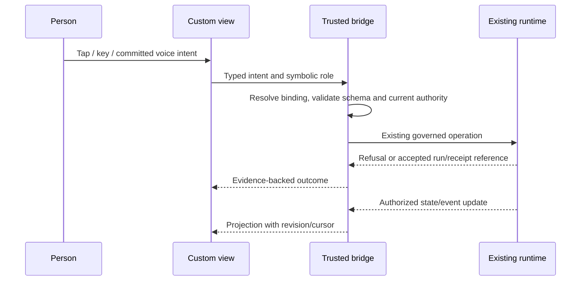

# Experience primitive contract and worked trace

Status: proposed, 2026-09-14. Initial provider: Codex.
Companion foundation: [PR #3840](https://github.com/Jonnyton/TinyAssets/pull/3840),
especially portable-harness-project/primitives.md and research.md.
The names below describe component contracts; they are not newly exposed tools.

## Scope of customization

An experience includes what a person sees/hears, how input becomes intent,
which state it observes, how it directs work, and when/where events reach them.
A theme picker alone does not satisfy this contract. Source editing, conversational
editing, and a future visual editor must modify the same inspectable definition.

Users may replace, remove, connect, nest, and share components. A command center,
game, office simulation or earbud setup is ordinary composition data, not an
engine enum. First-party experiences have no hidden control powers. The trusted
host retains authentication, grants, recovery and enforcement; these are not
editable content.

## Proposed semantic component contracts

All port schemas are bundled and versioned. Concrete names and namespace require
shape review. Identical locked schema identities or an explicit transform connect
ports; adapters validate payloads before use.

| Contract | Receives | Produces | Lifecycle and authority |
| --- | --- | --- | --- |
| Projection | Authorized resource role + cursor/revision | Typed snapshot or incremental update | Scoped subscription; teardown releases it; no private reads in preview |
| View | Projection + public config + private view preferences | Visual/audio/semantic presentation | Mount, update, suspend, dispose; no direct runtime mutation |
| Input mapping | Keyboard/touch/gesture/committed voice event | Typed semantic intent | Partial speech/transcription is not a committed action |
| Action binding | Semantic intent + symbolic target role | Existing action request, then outcome/run reference | Re-resolve private target and authority at dispatch |
| Event routing | Event + user-authored conditions | Zero or more destination requests | Existing channel authority; documented delivery behavior |
| Device adaptation | Host-declared capabilities + component requirements | Supported renderer or declared alternative | Do not silently change meaning or grant permissions |

These can be components in the existing native definition. Source, renderer
resources and schema files travel through the proposed project inventory.
Unknown kinds remain inspectable and exportable. Unsupported required execution
blocks activation on that device; unrelated supported devices may keep working.

The following bridge operations are semantic requirements to map to existing
handlers, not an approved second API: read/subscribe to an authorized projection;
submit an existing intent; inspect its result; acknowledge an event; negotiate
capabilities; release subscriptions. An implementation must document the concrete
handler and missing seam for each. Never add a new daemon or actor for a view.

## Data flow and trust boundary

The view cannot supply the authenticated principal, widen its role bindings,
read the vault, write canonical assistant replies, or obtain authority by naming
an operation. Tool/commons text rendered inside a component remains untrusted
content. A UI message or generated proposal is not automatically founder speech.

For a web adapter, isolate custom code from the authenticated origin. Validate
bridge message origin/source, installation identity, schema, request correlation,
and lifecycle generation. Teardown invalidates its bridge session and subscriptions;
a delayed message from the old view cannot act through a newly mounted binding.
CSP, allowed asset/network destinations and resource limits are enforced by the
host. Package declarations request capabilities, not network authorization.
Native renderers must provide an equivalent narrow bridge, not copy DOM-specific
assumptions. CPU/memory or rendering failure yields recovery, not a frozen control.

## Three kinds of identity, not one overloaded ID

| Identity | Purpose |
| --- | --- |
| source + event_id | Identifies the underlying fact; source is runtime-derived |
| event identity + destination + delivery identity | Tracks a destination delivery/retry under its adapter contract |
| interaction/request identity | Distinguishes an action from merely displaying or acknowledging an event |

Scope all three by the authenticated universe/installation where appropriate.
A shared definition contains none of the live values. Cross-device continuity
carries authorized references, never a copied session token.

Event ordering is only guaranteed within the documented stream. A projection
carries a cursor and entity revision. On reconnect, resume from that cursor;
if retention has expired, request a fresh snapshot and reconcile pending UI state.
Do not apply an older delta over a newer snapshot. Deduplicate replay within a
documented bounded window. Replayed presentation is not an instruction to rerun
work or send a new external effect.

Acknowledgment is an explicit governed operation. Delivery, view, acknowledgment,
action acceptance and task completion are distinct facts. A speech announcement
finishing or notification appearing cannot stand in for user approval.

## Worked cross-device trace

All values here are fixture labels, not live identifiers or a wire-ready schema.

| Step | Observed event / user intent | Expected result |
| --- | --- | --- |
| 1 | Start review from desktop; request q1 | Bridge binds the chosen document/provider, starts one supported run and records its reference |
| 2 | Replace board component with office room | Room projects the same run; authoring/preview starts nothing |
| 3 | Completion event (fixture-source, e17) arrives | Desktop shows a completed artifact; routing policy may request authorized phone delivery d1 |
| 4 | Earbuds reconnect and receive e17 again | Replay deduplicates; speech uses an authorized available adapter and configured interruption policy |
| 5 | Open phone from the notification | Phone resolves the same conversation/instance and fresh state; opening alone authorizes no action |
| 6 | User chooses an explicit follow-up action q2 | Bridge validates current target revision and grants before dispatch |
| 7 | Old notification repeats q2 after completion | Idempotent operation returns existing outcome, or adapter reports unsupported retry; no blind duplicate effect |
| 8 | Two devices activate edits based on revision 7 | One succeeds; the other gets conflict and retains its proposal |
| 9 | User rolls back the office view | Compatible prior definition/bindings restore; completed runs and effects remain completed |

A notification's tap may open the relevant view while locked, but private content
and actions are resolved only after authentication. When required device support
is absent, present an explicit unsupported outcome or a predeclared authorized
alternative. Simulated phone delivery must be visibly a fixture; it cannot be
counted as live push evidence.

## Device matrix and graceful failure

| Capability | Desktop/web proof | Phone proof | Earbud/voice behavior |
| --- | --- | --- | --- |
| Observe run / artifact | Board plus remixed office | Compact semantic list | Authorized speech summary explicitly labeled if not canonical reply |
| Act on a run | Keyboard and pointer use same intent | Touch uses same intent | Committed recognized intent only; ambiguous target asks for clarification |
| Conversation | Canonical text and writer | Same canonical conversation | Exact canonical reply via speech; speaking is not another writer |
| Spatial rendering | Optional adapter | Declared list alternative if unavailable | No claim of spatial equivalence; semantic selection remains available |
| Notifications | Evidence from available adapter | Actual adapter receipt required for delivery claim | Disconnect never authorizes private playback on speakers |
| Offline / suspended | Last-known state labeled with freshness | Same; disable or retain unsent intent locally | No silent offline replay of actions on reconnect |

First-party parity includes keyboard use, focus recovery, readable text alternatives,
reduced-motion behavior where relevant, and non-spatial operation of all required
controls. Validate rendered behavior with assistive technology/manual checks;
declaring an accessibility field is insufficient. An inaccessible custom experience
must not trap the user: the trusted recovery surface can disable it.

## Evolution and discovery

The author can inspect a component's source, interface, dependencies, lineage and
effect requirements before remixing it. Discovery may index declared metadata and
public evaluation evidence, but does not execute the package or subscribe to its
private bindings. Publishing a definition never changes anyone's active install.

Personalization is a candidate edit with a diff, fixture preview, changed capability
requirements and explicit activation. Learned preferences remain private. Users
can opt out and continue editing by hand. A private modification is not published
because a model calls it generally useful.

Revision migration is explicit: either a pure, bounded schema migration under
the governed adapter with no effects, or an actionable incompatibility. Do not
merge conflicting live preferences by guessing. Deleting a referenced component
shows unresolved connections before activation. Rollback rechecks current grants
and state compatibility; it cannot restore a revoked credential.

## Implementation review and evidence

- Map projection/actions/events to existing handlers before fixing the bridge API.
- Specify event retention, gap recovery and revision conflict behavior in the
  adapter contract. No hardcoded universal retention duration is selected here.
- Name and test the isolation boundary for each renderer, including stale bridge
  messages, imports with executable assets, and denied calls after revocation.
- Freeze one board/office/phone fixture with common semantic bindings; demonstrate
  changing its presentation without changing its harness, then the inverse.
- Prove a second account imports source/lineage, binds its own resources and
  activates explicitly; inspect public artifacts for seeded private sentinels.
- Retain actual rendered evidence, adapter receipts and exact revisions. Record
  unsupported device capabilities honestly. Shape/research review remains required
  before implementing public/storage/authority seams.

External evidence and design inferences are recorded in research.md in this change.
