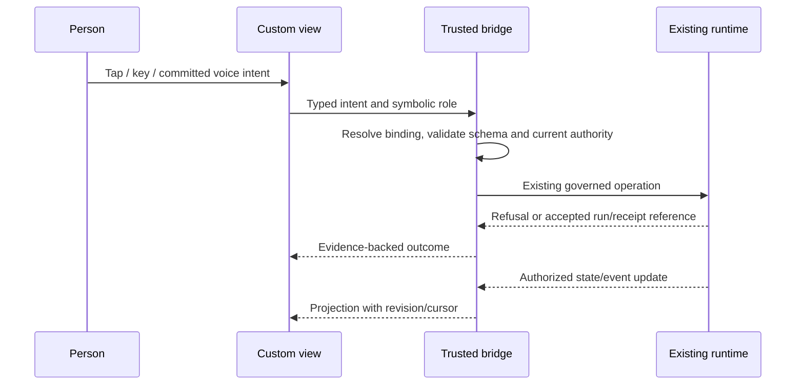

# Experience primitive contract and worked trace

Status: proposed, 2026-09-14. Initial provider: Codex.
Companion foundation: [PR #3840](https://github.com/Jonnyton/TinyAssets/pull/3840),
especially portable-harness-project/primitives.md and research.md.
The names below describe component contracts; they are not newly exposed tools.

The final section follows an editable control from input to canonical outcome
and specifies prepared intent, remount recovery and the first rendered proof.

## Scope of customization

An experience includes what a person sees/hears, how input becomes intent,
which state it observes, how it directs work, and when/where events reach them.
A theme picker alone does not satisfy this contract. Source editing, conversational
editing, and a future visual editor must modify the same inspectable definition.

Users may replace, remove, connect, nest, and share components. A command center,
game, office simulation or earbud setup is ordinary composition data, not an
engine enum. First-party experiences have no hidden control powers. The trusted
host retains authentication, grants, recovery and enforcement; these are not
editable content.

## Proposed semantic component contracts

All port schemas are bundled and versioned. Concrete names and namespace require
shape review. Identical locked schema identities or an explicit transform connect
ports; adapters validate payloads before use.

| Contract | Receives | Produces | Lifecycle and authority |
| --- | --- | --- | --- |
| Projection | Authorized resource role + cursor/revision | Typed snapshot or incremental update | Scoped subscription; teardown releases it; no private reads in preview |
| View | Projection + public config + private view preferences | Visual/audio/semantic presentation | Mount, update, suspend, dispose; no direct runtime mutation |
| Input mapping | Keyboard/touch/gesture/committed voice event | Typed semantic intent | Partial speech/transcription is not a committed action |
| Action binding | Semantic intent + symbolic target role | Existing action request, then outcome/run reference | Re-resolve private target and authority at dispatch |
| Event routing | Event + user-authored conditions | Zero or more destination requests | Existing channel authority; documented delivery behavior |
| Device adaptation | Host-declared capabilities + component requirements | Supported renderer or declared alternative | Do not silently change meaning or grant permissions |

These can be components in the existing native definition. Source, renderer
resources and schema files travel through the proposed project inventory.
Unknown kinds remain inspectable and exportable. Unsupported required execution
blocks activation on that device; unrelated supported devices may keep working.

The following bridge operations are semantic requirements to map to existing
handlers, not an approved second API: read/subscribe to an authorized projection;
submit an existing intent; inspect its result; acknowledge an event; negotiate
capabilities; release subscriptions. An implementation must document the concrete
handler and missing seam for each. Never add a new daemon or actor for a view.

## Data flow and trust boundary

The view cannot supply the authenticated principal, widen its role bindings,
read the vault, write canonical assistant replies, or obtain authority by naming
an operation. Tool/commons text rendered inside a component remains untrusted
content. A UI message or generated proposal is not automatically founder speech.

For a web adapter, isolate custom code from the authenticated origin. Validate
bridge message origin/source, installation identity, schema, request correlation,
and lifecycle generation. Teardown invalidates its bridge session and subscriptions;
a delayed message from the old view cannot act through a newly mounted binding.
CSP, allowed asset/network destinations and resource limits are enforced by the
host. Package declarations request capabilities, not network authorization.
Native renderers must provide an equivalent narrow bridge, not copy DOM-specific
assumptions. CPU/memory or rendering failure yields recovery, not a frozen control.

## Three kinds of identity, not one overloaded ID

| Identity | Purpose |
| --- | --- |
| source + event_id | Identifies the underlying fact; source is runtime-derived |
| event identity + destination + delivery identity | Tracks a destination delivery/retry under its adapter contract |
| interaction/request identity | Distinguishes an action from merely displaying or acknowledging an event |

Scope all three by the authenticated universe/installation where appropriate.
A shared definition contains none of the live values. Cross-device continuity
carries authorized references, never a copied session token.

Event ordering is only guaranteed within the documented stream. A projection
carries a cursor and entity revision. On reconnect, resume from that cursor;
if retention has expired, request a fresh snapshot and reconcile pending UI state.
Do not apply an older delta over a newer snapshot. Deduplicate replay within a
documented bounded window. Replayed presentation is not an instruction to rerun
work or send a new external effect.

Acknowledgment is an explicit governed operation. Delivery, view, acknowledgment,
action acceptance and task completion are distinct facts. A speech announcement
finishing or notification appearing cannot stand in for user approval.

## Worked cross-device trace

All values here are fixture labels, not live identifiers or a wire-ready schema.

| Step | Observed event / user intent | Expected result |
| --- | --- | --- |
| 1 | Start review from desktop; request q1 | Bridge binds the chosen document/provider, starts one supported run and records its reference |
| 2 | Replace board component with office room | Room projects the same run; authoring/preview starts nothing |
| 3 | Completion event (fixture-source, e17) arrives | Desktop shows a completed artifact; routing policy may request authorized phone delivery d1 |
| 4 | Earbuds reconnect and receive e17 again | Replay deduplicates; speech uses an authorized available adapter and configured interruption policy |
| 5 | Open phone from the notification | Phone resolves the same conversation/instance and fresh state; opening alone authorizes no action |
| 6 | User chooses an explicit follow-up action q2 | Bridge validates current target revision and grants before dispatch |
| 7 | Old notification repeats q2 after completion | Idempotent operation returns existing outcome, or adapter reports unsupported retry; no blind duplicate effect |
| 8 | Two devices activate edits based on revision 7 | One succeeds; the other gets conflict and retains its proposal |
| 9 | User rolls back the office view | Compatible prior definition/bindings restore; completed runs and effects remain completed |

A notification's tap may open the relevant view while locked, but private content
and actions are resolved only after authentication. When required device support
is absent, present an explicit unsupported outcome or a predeclared authorized
alternative. Simulated phone delivery must be visibly a fixture; it cannot be
counted as live push evidence.

## Device matrix and graceful failure

| Capability | Desktop/web proof | Phone proof | Earbud/voice behavior |
| --- | --- | --- | --- |
| Observe run / artifact | Board plus remixed office | Compact semantic list | Authorized speech summary explicitly labeled if not canonical reply |
| Act on a run | Keyboard and pointer use same intent | Touch uses same intent | Committed recognized intent only; ambiguous target asks for clarification |
| Conversation | Canonical text and writer | Same canonical conversation | Exact canonical reply via speech; speaking is not another writer |
| Spatial rendering | Optional adapter | Declared list alternative if unavailable | No claim of spatial equivalence; semantic selection remains available |
| Notifications | Evidence from available adapter | Actual adapter receipt required for delivery claim | Disconnect never authorizes private playback on speakers |
| Offline / suspended | Last-known state labeled with freshness | Same; disable or retain unsent intent locally | No silent offline replay of actions on reconnect |

First-party parity includes keyboard use, focus recovery, readable text alternatives,
reduced-motion behavior where relevant, and non-spatial operation of all required
controls. Validate rendered behavior with assistive technology/manual checks;
declaring an accessibility field is insufficient. An inaccessible custom experience
must not trap the user: the trusted recovery surface can disable it.

## Evolution and discovery

The author can inspect a component's source, interface, dependencies, lineage and
effect requirements before remixing it. Discovery may index declared metadata and
public evaluation evidence, but does not execute the package or subscribe to its
private bindings. Publishing a definition never changes anyone's active install.

Personalization is a candidate edit with a diff, fixture preview, changed capability
requirements and explicit activation. Learned preferences remain private. Users
can opt out and continue editing by hand. A private modification is not published
because a model calls it generally useful.

Revision migration is explicit: either a pure, bounded schema migration under
the governed adapter with no effects, or an actionable incompatibility. Do not
merge conflicting live preferences by guessing. Deleting a referenced component
shows unresolved connections before activation. Rollback rechecks current grants
and state compatibility; it cannot restore a revoked credential.

## Implementation review and evidence

- Map projection/actions/events to existing handlers before fixing the bridge API.
- Specify event retention, gap recovery and revision conflict behavior in the
  adapter contract. No hardcoded universal retention duration is selected here.
- Name and test the isolation boundary for each renderer, including stale bridge
  messages, imports with executable assets, and denied calls after revocation.
- Freeze one board/office/phone fixture with common semantic bindings; demonstrate
  changing its presentation without changing its harness, then the inverse.
- Prove a second account imports source/lineage, binds its own resources and
  activates explicitly; inspect public artifacts for seeded private sentinels.
- Retain actual rendered evidence, adapter receipts and exact revisions. Record
  unsupported device capabilities honestly. Shape/research review remains required
  before implementing public/storage/authority seams.

External evidence and design inferences are recorded in research.md in this change.

## Authoring and evolution without losing the user's work (second refinement)

The minimum complete authoring loop is inspect → edit → preview → bind → activate
→ observe → revise/export. Each step has an artifact the user can inspect.
A visual editor, conversational editor and source editor must round-trip the same
definition without discarding fields they do not understand. An editor may refuse
an unsupported edit, but must retain the original source and explain the limitation.

Preview uses fixture projections and simulated outcomes by default. It displays
its simulation status and cannot silently invoke live bindings. A user may choose
a separately authorized live test under current scope; that test produces ordinary
run/effect evidence. Saving, publishing and opening preview remain inert.

First-party parity is checked by exporting the actual first-party composition and
remixing it in a second account, with no internal-only action names or privileged
resource roles. If a first-party behavior cannot be reproduced through the public
composition contract, record the exact missing seam. A hand-built lookalike demo
does not satisfy parity.

### Private overlays and upstream upgrades

Keep public defaults, private shared preferences and device-local transient state
separate. A candidate update records the upstream base revision, new upstream
revision, private overlay revision and schema versions. Compute the user's
three-way diff against that base, preserving edits keyed by stable component/port
identities rather than display labels or screen positions.

Independent changes can be proposed together. If upstream removes a component the
user customized, changes a port contract, or modifies the same setting, preserve
the user's old composition and present the conflict. Never silently drop custom
source or reset a preference to make an upgrade succeed. Store a conflicted candidate
separately from the still-active revision. Pinning or forking the old version must
remain an ordinary authoring choice.

Automatic personalization follows the same candidate process. The user sees the
changed behavior, affected devices and capability difference. Activation compares
the expected installation/overlay revision; simultaneous activations produce a
conflict, not a last-writer-wins overwrite. A definition update does not migrate
open drafts, canonical conversation, or already-running work by implication.

### Cross-device state classes and recovery

| Class | Reconciliation policy | Example |
| --- | --- | --- |
| Canonical operation/approval state | Server-authoritative revision and existing guarded operation | Cancel a run, answer an access request |
| Shared private preferences | Revision-guarded candidate edit; explicit conflict | Quiet hours or default experience |
| Device-local transient state | Retain locally; only promote deliberately | Focus, scroll position, unsent text |
| Presentation projection/cache | Replace from authorized snapshot/cursor contract | Run card or office occupant status |
| Public source/definition | Immutable revisions with explicit remix/upgrade | Office layout and action mappings |

This is a policy selection, not a general synchronization engine. CRDT-style merge
may eventually help collaborative source/draft editing; it must not merge approval
decisions or invent authority from two offline replicas.

A projection snapshot must pair state with a cursor from one documented consistency
boundary. If the adapter cannot do that atomically, it needs a specified subscribe/
buffer/snapshot reconciliation protocol. "Fetch then subscribe" without gap
handling is insufficient. On cursor expiry, invalidate the old delta chain, obtain
a snapshot and resume only from its documented boundary. Do not treat timestamps
from different devices as a global event order.

When access is revoked, stop the affected subscription and clear its live projection
and actionable bindings. Previously viewed or downloaded data cannot be promised
to disappear from a person's possession; cache retention/purge behavior must be
documented by the adapter. Reconnecting a stale device rechecks authority before
hydrating private data or submitting retained intent.

### Notification and voice routing is programmable behavior

A user-defined route can choose conditions, priority, quiet hours, grouping,
expiry and declared fallback destinations. Runtime adapters still enforce current
channel permissions and expose the delivery guarantees they actually provide.
The route emits a delivery intent; it cannot assert "the user saw it."

Distinguish routing suppression, queued delivery, provider acceptance, confirmed
delivery where supported, view/acknowledgment and canonical task outcome. An expired
notification can still link to the current task, but its stale action payload
must be revalidated. A notification grouping key is presentation policy; it must
not accidentally collapse distinct action requests or grant requests.

Voice has separate listening, draft-transcript, committed-input and playback state.
Barge-in may stop speech without cancelling the underlying run. A run cancellation
requires an explicit supported intent. Losing the earbud connection must not switch
private playback to a speaker unless the user's configured, permitted policy says
so. Clarification is required for ambiguous targets; a guessed device or instance
cannot select the authority context.

The trusted recovery control remains reachable outside a custom renderer's focus
and execution loop. It can disable that experience and restore a usable surface
without cancelling unrelated work. For an office experience, moving an item by
drag must have an equivalent non-drag control, and keyboard operation must reach
the same semantic action. Test both; one does not imply the other.

### Concrete device and evolution conformance traces

These are required future proofs, not implemented tests. Retain exact source and
binding revisions, adapter/device profile, fixture cursor history, semantic action
records, effect counts and rendered evidence. Screenshot appearance alone cannot
prove action or identity continuity.

| ID | Given / action | Required observation |
| --- | --- | --- |
| E-C1 | Edit a source field the visual editor does not understand, then save via that editor | Preserve it verbatim or refuse the edit without damaging source |
| E-C2 | Preview an imported office with "start work" gesture mapping | Show simulated outcome; zero live runs, deliveries or subscriptions |
| E-C3 | Upstream removes a privately customized room/action | Conflict candidate retains the customization; active experience still works |
| E-C4 | Two devices activate different edits based on the same revision | One wins the guarded update; the other retains a reviewable conflict |
| E-C5 | Event occurs between snapshot retrieval and subscription | Adapter reconciliation yields the event or a newer state covering it; no silent gap |
| E-C6 | Reconnect after cursor expiry, then receive an old delta | Fresh snapshot governs; stale delta cannot regress visible state or reissue effects |
| E-C7 | Revoke access while a room projects private work | Subscription stops; stale renderer actions fail; unaffected components remain usable |
| E-C8 | Route groups two notifications referring to different pending requests | Each request retains its own target and identity; grouping answers neither |
| E-C9 | Earbuds disconnect during a reply; user interrupts playback after reconnect | No unintended speaker playback; interruption alone does not cancel the run |
| E-C10 | Office drag, non-drag pointer control and keyboard control perform the same action | Same semantic intent/target and governed outcome; focus remains recoverable |
| E-C11 | Renderer loops or crashes while a run is active | Independent recovery disables it; canonical run and conversation remain intact |
| E-C12 | Swap harness context strategy, then board to office/phone, on one fixture | Unchanged instance/conversation; independent source diffs and bindings; same outcome references |

E-C12 and harness H-C10 are one shared acceptance trace. Include the second-account
remix and private sentinel exclusion already required above. The first experience
slice proves one ordinary desktop/phone composition and its bridge; a full office,
game or native earbud adapter must remain explicitly unsupported until separately
demonstrated. The general contract must allow those adapters without adding engine
enums for each experience.

## A buildable interaction has inspectable meaning (third refinement)

### Trace a control all the way to its result

The experience editor must expose the mapping from source input to semantic intent,
symbolic target, installed operation contract, and observed outcome. A button label,
room name or animation cannot define authority. Selecting a different target
invalidates any prepared action tied to the previous target.

A minimal action presentation includes its name, selected target, required input,
availability/reason, pending state and evidence-backed outcome. These are semantic
responsibilities, not prescribed visual fields. The office, phone and accessible
list can present them differently while referring to the same operation contract.

| User construction | Editable composition | Host/adapter responsibility |
| --- | --- | --- |
| Place a room around a running task | Projection-to-view mapping and selection rules | Authorized resource resolution; canonical task identity |
| Map a gesture to a control | Input-to-intent mapping and explicit arguments | Validate installed operation, target and current authority |
| Add a progress cue | Outcome-to-presentation mapping | Distinguish accepted, running, terminal and uncertain delivery |
| Route a completed artifact to a phone | Event condition, grouping, destination role | Channel authorization and truthful delivery evidence |
| Replace office with a list | Renderer and non-spatial input alternatives | Preserve meaning, available controls and recovery access |

Offer a "why this control?" inspection from the authoring surface: component path,
input mapping, public operation contract, symbolic target role and capability
diagnostics. Concrete private target values are shown only to authorized users.
The same trace should help diagnose an ineffective gesture without reading backend
implementation details in the ordinary product flow.

### Input commitment and pending actions

Treat listening, partial transcription, committed intent, dispatch and observed
outcome as distinct transitions. Pure input-state transitions finish consistently
before consuming the next committed event; external operations remain asynchronous.
This does not require a new scheduler or SCXML interpreter.

A prepared interaction records its source/binding revision, target and canonical
arguments. If any changes before submission, rebuild the preparation and expose
materially changed meaning. The host binds dispatch to the current authenticated
session and renderer generation. A displayed old preparation is not an authority
token and cannot silently retarget a command.

Once accepted, the UI retains the returned canonical reference. A rerender, lost
connection or second tap must not replace that reference with a freshly started
run. For an adapter that supports retries, reuse the same request identity for the
same intent; changing the target/arguments is a new intent. For an adapter without
deduplication or reconciliation, present the unknown outcome and inspection path.
Do not invent a universal safe Retry button.

A newer component may observe pending work after an authorized handoff, but cannot
resubmit it simply because its local pending state is empty. The old renderer's
bridge is revoked; the canonical work remains available through authorized reads.
Unsent drafts are a separate, deliberate transfer choice and never auto-submit.

### Sharing and the web bridge

Published examples use synthetic targets and fixture artifacts. Before publishing,
the author sees the inventoried source/assets and which private fields were
excluded. A public artifact reference is not a substitute for filtering private
data inside source, fixtures, logs or assets. Retain seeded exclusion evidence.

Notification/handoff links carry non-authorizing references. The receiving host
authenticates and resolves them afresh. No grant, bearer URL, device token or
session credential belongs in a shared definition, ordinary deep link or renderer
message. Sharing a link does not transfer the sender's action permission.

The web adapter must specify a concrete bootstrap protocol. Validate both message
origin where meaningful and expected source/window or bound message port, message
schema and lifecycle generation. For opaque sandbox origins, do not treat the
literal origin "null" as trusted: pin the created frame/port and host-created
session through a reviewed handshake. Never send confidential data with a wildcard
target origin. If the intended sandbox cannot support a confined communication
path, report that adapter unsupported until the bridge design is reviewed.

Apply adapter budgets to input/message processing and rendering. Recovery must
remain responsive outside the custom component's execution loop; catching a
renderer exception alone does not demonstrate recovery from an infinite loop.
The first web proof must identify how execution isolation makes recovery possible.

### Observable first slice

Use one ordinary desktop board and phone list built from the same source. A user
edits one input mapping and one routing condition, previews with fixtures, activates
under their existing bindings, and observes the canonical result. Then export the
actual composition for a second account. The editable source and semantic traces
prove buildability; screenshots alone do not.

Show pending, refusal, delivery uncertainty and completion in text/accessible status
as well as visual cues. Routine status updates should not steal focus. Retain manual
keyboard, non-drag and assistive-technology observations; one status role does not
establish complete accessibility compliance.

| ID | Given / action | Required observation |
| --- | --- | --- |
| E-C13 | Target changes after preparing a control, before dispatch | Old preparation is invalidated; no silent action on the newly selected target |
| E-C14 | Accepted action loses its reply view, then the renderer remounts | Recover canonical reference where supported; never start new work merely to fill an empty pending view |
| E-C15 | Unrelated opaque-origin frame sends a valid-looking bridge message | Host rejects the wrong source/port/session; a "null" origin does not confer trust |
| E-C16 | Pending action becomes refused or delivery-uncertain | Accessible outcome matches canonical evidence; no false completion or unconditional Retry |

E-C13–E-C16 belong to the first action/renderer proof where applicable, alongside
E-C2, E-C7 and E-C11. Office/game/native voice expansions follow the usable first
slice and retain the same semantic contracts. No visual archetype registry is needed.
