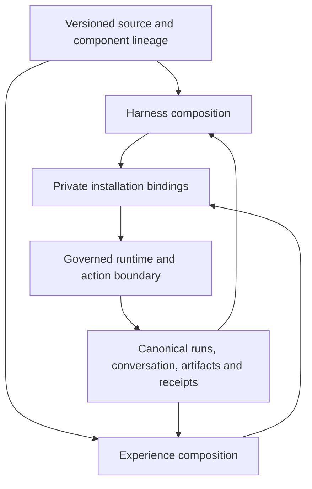

# Foundational composition contract

Status: proposed semantic contract, 2026-09-14. Initial provider: Codex.
This is the detailed companion to design.md and UI refinement PR #3842. Names in examples
are author-defined roles, not newly registered MCP tools or shipped schemas.

## One substrate, independently replaceable compositions

A harness is the composition deciding how work proceeds. An experience is the
composition through which a person observes, directs, and reshapes that work.
Both use Node, Edge, State, Scope, Run, and Trigger. Neither owns a second
instance registry, conversation writer, authorization system, or effect ledger.

The authoring toolset is a small vocabulary of operations over these objects:
inspect, create/edit, connect typed ports, compose/invoke, evaluate, export/import,
remix, and explicitly bind/activate. Those behaviors must resolve through existing
canonical handles and handlers where supported. An ergonomic editor or chatbot
can bundle several operations into one reviewable change. It cannot silently
turn authoring into execution.

PLAN.md's canonical handles describe architectural responsibilities, not a claim
that every control verb is exposed by every current client. A future builder must
check the actual served action catalog before wiring a control. In particular,
a conceptual pause/resume/replay operation is not proof that a particular Run
supports it. Offer supported controls and precise unsupported outcomes.

## Primitive-to-composition map

"Existing anchor" identifies reusable code or a current contract; "gap" is the
additional proof needed. This is not an exhaustive audit of production behavior.

| Base concept / behavior | Existing anchor | User composition | Gap this proposal must prove |
| --- | --- | --- | --- |
| Node + Edge + State | graph compiler and Branch definitions | Sequence, branch, reduce, child invocation, evaluator | Exported source resolves the same graph semantics locally |
| Definition + lineage | custom_agents._normalize_components, _normalize_lineage, publish_definition | Replace or blend named components from multiple authors | Project-file references survive native validation and interchange |
| Scope + binding | custom_agents._normalize_binding_payload, create_binding, update_binding | Select private resources/provider roles | Destination binds independently; source grants never travel |
| Run + evidence | api/runs.py and api/run_outputs.py | Observe progress, evaluate outcome, propose next work | Portable runner documents supported lifecycle and receipt fidelity |
| Trigger | Existing Branch scheduling/event mechanisms | User-authored recurrence, routing and stop policy | Export records requirements; import starts no schedules |
| Deterministic work + effects | Sandboxed source_code, workspace and authenticated_external_call contracts | Transform source, invoke tools, deliver artifacts | Runtime capability checks cover every declared effect |
| Canonical conversation | universe-personification-and-relay current spec | Voice, typed messages and surface handoff | Experience controls relay into the same writer |
| Rendering | Existing onboarding/desktop surfaces | Board, office, game, voice, notification composition | A generic governed renderer and semantic bridge remain unproven |

A custom context strategy, retry policy, office room, quiet-hours rule, or
"research assistant" is a composition. A host-enforced permission check,
resource boundary, or typed adapter dispatch is infrastructure. A proposed
infrastructure addition must identify a concrete composition that cannot work,
the existing handlers tried, and the smallest missing seam. This round does not
approve a new top-level handle or a fixed registry of agent/UI archetypes.

## What authors can replace

These are examples of component roles; users may name and organize them
differently. No mandatory six-stage loop is implied.

| Role | Input -> output | Replaceable behavior | Boundary retained by runtime |
| --- | --- | --- | --- |
| Context selection | Task + authorized artifact refs -> context bundle with provenance | Retrieval, ordering, summarization, compression | Access checks; imported content stays data |
| Memory policy | Observations + prior entries -> proposed write set | Organization, retention and learning strategy | Durable write authority and source attribution |
| Planning / loop | Current state + observations -> next node/action or stop | ReAct-like loop, plan/execute, deterministic graph, custom scheduler | Run identity, budgets, cancellation and permitted transitions |
| Tool selection / transformation | Typed intent + available capabilities -> call or transformed value | Tool choice, argument construction, custom code | Dispatch validation, sandbox, resource/effect authorization |
| Evaluation | Frozen fixture + candidate artifact -> findings with evidence | Rubric, evaluator choice, improvement strategy | Candidate cannot rewrite the evaluator used to judge it |
| Presentation / interaction | Authorized projection + input -> render or semantic intent | Layout, narrative, gestures, voice and event routing | Canonical state, user identity and action authority |

A component's removal must produce an explicit wiring error if another component
still depends on it. Replacing a component creates a new definition revision;
it does not rewrite earlier run evidence or the parent's source.

## Typed component interface

The proposed adapter profile gives executable components the following metadata
inside the existing open component payload. The native envelope stays unchanged.

| Field | Proposed meaning |
| --- | --- |
| kind | User-named component kind; preservation is independent of execution support |
| contract | Versioned interface identifier, resolved from the locked project |
| source | Inventoried relative source or asset reference |
| inputs / outputs | Named ports referencing packaged schemas |
| requires | Symbolic runtime/device/resource capabilities, never credential values |
| config | Public defaults and other deliberately shareable composition data |
| connections | Explicit source-port to destination-port mappings in the composition |

The existing agent_runtime_compiler.GovernedComponentDescriptor already carries
adapter_ref/version/digest, typed_inputs/typed_outputs, configuration_schema,
required capability/resource/provider classes, confinement_class and budgets.
compile_agent_components resolves adapters and reports adapter_ambiguous,
adapter_unavailable, sandbox_unavailable and configuration_invalid. Reuse that
descriptor and compiler; the table above is an authoring profile mapped onto it,
not a second descriptor registry. Public requires declarations cannot override
the installed descriptor's enforced requirements.

The current configuration_schema is a limited typed-field contract, not general
JSON Schema. Bundled rich port schemas are a proposed profile/adapter validation
layer; implementing them must specify the mapping and tests without silently
changing existing descriptor semantics. Private runtime component selection
already supports execute/descriptive_only. A required executable dependency
cannot be made runnable by relabeling it descriptive_only; compatibility checks
must validate the required dependency closure.

Select the exact namespaced profile after cross-family shape review. A parser
must not infer executability from the presence of source or a familiar kind name.
Activation resolves kind + interface version against an installed governed adapter.

Use bundled JSON Schema 2020-12 for port payload validation. Do not attempt general
schema-subtyping inference as a first contract: connected ports use identical
locked schema identities, or an explicit transform node with its own validated
input/output. Missing ports, duplicate connections into a single-valued port,
unresolved references, and unsupported required adapters fail before activation.
Schema references resolve from the inventory; validation never fetches the network.
A schema's validity does not establish that an action is permitted.

Graph structure uses the existing Branch contract. This profile does not introduce
a second scheduler or a bespoke expression language. Pure transforms can use
governed code nodes. Intentional iteration must use the runtime's supported
control-flow contract, with usage budgets and a stop/cancel path. No new fixed
graph-size ceiling is introduced here.

## Semantic invocation and outcome

At the bridge, an invocation is associated with:
- the pinned definition and installation revisions;
- operation identity and schema-validated arguments;
- the current authorized target reference;
- request identity, and expected target revision where the operation supports it;
- parent run/node correlation for work, or originating interaction for UI.

Actor, universe, grants, and authoritative timestamps are derived by the trusted
boundary. Component-supplied values are never accepted as authority. Public
packages contain symbolic resource roles; concrete references stay private.

The bridge distinguishes accepted from completed. A long operation returns an
existing run/receipt reference and a way to inspect its outcome. Refusal carries
a machine-readable reason and actionable context without exposing private values.
Adapters preserve native failure details instead of turning every error into prose
or claiming every operation has the same lifecycle.

Transport retry uses the same request identity only where the target operation
has a documented idempotency contract. An intentional new attempt gets a new
identity linked to the previous one. If delivery outcome is unknown and the
destination cannot deduplicate, reconcile before resubmitting; do not promise
exactly-once behavior for arbitrary HTTP services.

Cancellation is cooperative: requested is different from terminal cancelled.
Cancellation never rewinds delivered effects. Run replay used for evaluation
uses recorded inputs and mock/recorded effect results by default; re-executing
external effects is a separate explicit action under current authority.

## Durable state versus presentation state

| State | Owner and persistence | Export |
| --- | --- | --- |
| Public definition and source | Immutable definition/project revision | Deliberately inventoried |
| Installation bindings | Destination universe, revision guarded | Separate private export under selected custody |
| Run and conversation | Existing canonical runtime/conversation stores | Outside definition export |
| Custom durable domain memory | User-chosen schema and governed store | Outside public export unless explicitly authored as shareable source |
| Shared experience settings | Private installation revision | Separate from definition defaults |
| Device-local focus/draft | Device/session unless explicitly promoted | Never incidentally published |

Memory policy may propose writes; observations from tools, commons or another
agent cannot become founder instructions simply by entering a context bundle.
Preserve origin and trust distinctions through compaction and cross-device relay.

No claim of universal live-session migration follows from source portability.
Moving a running automation between executors needs its own single-active
handoff, checkpoint compatibility and effect reconciliation contract. A copied
project does not resume the original user's run.

## Worked harness and cross-device composition

A user builds a source-backed "review a document" Branch:
1. A resource role supplies a document through an authorized read.
2. A replaceable context node selects relevant passages.
3. A user-selected provider node proposes edits.
4. An evaluator checks a frozen rubric; the loop may revise within its budget.
5. An artifact node records the result; an authorized route may notify the user.

A desktop board, spatial office room, and compact phone card all project the
same run. A voice interaction selects the same conversation and sends a committed
intent through the same action binding. The room cannot infer permission to
start a run from a character walking into it; the experience must map that gesture
to an explicit supported intent.

The user replaces context selection without changing the UI. Then replaces the
board with an office without changing the Branch or creating another instance.
A second account imports both definitions, binds its own document/provider/channel,
and gets neither the first user's content nor an activated workflow.

This model-backed example is the behavioral target. The deterministic offline
fixture in design.md is the first packaging proof, not evidence that replaceable
agent loops, provider portability, voice, or phone push work.

## Evidence ladder and decision record

| Proof | Required artifact | What it does not prove |
| --- | --- | --- |
| P1: package | Fingerprints, inventory verification, inert round-trip | Execution support |
| P2: offline runtime | Frozen deterministic fixture result; source edit changes output | Model-backed harness parity |
| P3: harness replacement | Same task/fixtures with two context or loop components; traces and bounded effects | Every future adapter |
| P4: experience replacement | Same instance/conversation with two UIs and two device classes | All native surfaces |
| P5: second account | Private rebinding, exclusion sentinels and rendered interaction | Universal private-state migration |

P1/P2 belong to #3840's first implementation. P4 belongs to the UI proposal
in merged #3841 and refinement #3842. P3/P5 are required before claiming the combined fundamental
toolset is complete. These proofs constrain the final shared contract; they are
not permission to ship incompatible interim storage or API shapes.

Review must decide the profile namespace, schema resolver, local runtime entry
point, renderer bridge, event cursor semantics and bounded package transport.
Each decision names the current owner module and a conformance fixture.
Unresolved decisions block implementation of that seam; they do not invalidate
preservation or authoring of an unsupported composition.
