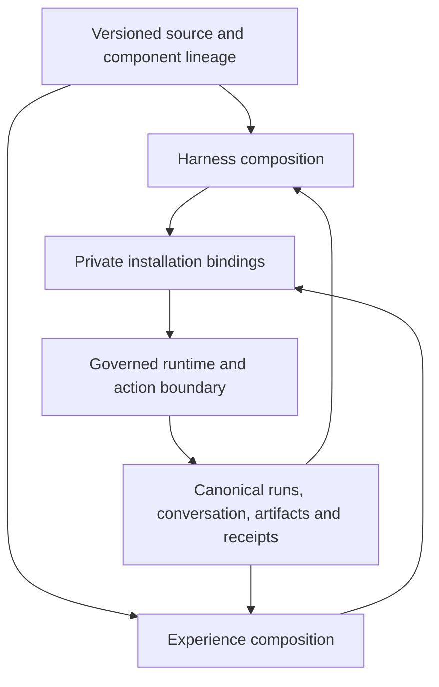

# Foundational composition contract

Status: proposed semantic contract, 2026-09-14. Initial provider: Codex.
This is the detailed companion to design.md and UI refinement PR #3842. Names in examples
are author-defined roles, not newly registered MCP tools or shipped schemas.

The builder-operation table and action semantics near the end define the next
construction exercise and capability-by-capability implementation order.

## One substrate, independently replaceable compositions

A harness is the composition deciding how work proceeds. An experience is the
composition through which a person observes, directs, and reshapes that work.
Both use Node, Edge, State, Scope, Run, and Trigger. Neither owns a second
instance registry, conversation writer, authorization system, or effect ledger.

The authoring toolset is a small vocabulary of operations over these objects:
inspect, create/edit, connect typed ports, compose/invoke, evaluate, export/import,
remix, and explicitly bind/activate. Those behaviors must resolve through existing
canonical handles and handlers where supported. An ergonomic editor or chatbot
can bundle several operations into one reviewable change. It cannot silently
turn authoring into execution.

PLAN.md's canonical handles describe architectural responsibilities, not a claim
that every control verb is exposed by every current client. A future builder must
check the actual served action catalog before wiring a control. In particular,
a conceptual pause/resume/replay operation is not proof that a particular Run
supports it. Offer supported controls and precise unsupported outcomes.

## Primitive-to-composition map

"Existing anchor" identifies reusable code or a current contract; "gap" is the
additional proof needed. This is not an exhaustive audit of production behavior.

| Base concept / behavior | Existing anchor | User composition | Gap this proposal must prove |
| --- | --- | --- | --- |
| Node + Edge + State | graph compiler and Branch definitions | Sequence, branch, reduce, child invocation, evaluator | Exported source resolves the same graph semantics locally |
| Definition + lineage | custom_agents._normalize_components, _normalize_lineage, publish_definition | Replace or blend named components from multiple authors | Project-file references survive native validation and interchange |
| Scope + binding | custom_agents._normalize_binding_payload, create_binding, update_binding | Select private resources/provider roles | Destination binds independently; source grants never travel |
| Run + evidence | api/runs.py and api/run_outputs.py | Observe progress, evaluate outcome, propose next work | Portable runner documents supported lifecycle and receipt fidelity |
| Trigger | Existing Branch scheduling/event mechanisms | User-authored recurrence, routing and stop policy | Export records requirements; import starts no schedules |
| Deterministic work + effects | Sandboxed source_code, workspace and authenticated_external_call contracts | Transform source, invoke tools, deliver artifacts | Runtime capability checks cover every declared effect |
| Canonical conversation | universe-personification-and-relay current spec | Voice, typed messages and surface handoff | Experience controls relay into the same writer |
| Rendering | Existing onboarding/desktop surfaces | Board, office, game, voice, notification composition | A generic governed renderer and semantic bridge remain unproven |

A custom context strategy, retry policy, office room, quiet-hours rule, or
"research assistant" is a composition. A host-enforced permission check,
resource boundary, or typed adapter dispatch is infrastructure. A proposed
infrastructure addition must identify a concrete composition that cannot work,
the existing handlers tried, and the smallest missing seam. This round does not
approve a new top-level handle or a fixed registry of agent/UI archetypes.

## What authors can replace

These are examples of component roles; users may name and organize them
differently. No mandatory six-stage loop is implied.

| Role | Input -> output | Replaceable behavior | Boundary retained by runtime |
| --- | --- | --- | --- |
| Context selection | Task + authorized artifact refs -> context bundle with provenance | Retrieval, ordering, summarization, compression | Access checks; imported content stays data |
| Memory policy | Observations + prior entries -> proposed write set | Organization, retention and learning strategy | Durable write authority and source attribution |
| Planning / loop | Current state + observations -> next node/action or stop | ReAct-like loop, plan/execute, deterministic graph, custom scheduler | Run identity, budgets, cancellation and permitted transitions |
| Tool selection / transformation | Typed intent + available capabilities -> call or transformed value | Tool choice, argument construction, custom code | Dispatch validation, sandbox, resource/effect authorization |
| Evaluation | Frozen fixture + candidate artifact -> findings with evidence | Rubric, evaluator choice, improvement strategy | Candidate cannot rewrite the evaluator used to judge it |
| Presentation / interaction | Authorized projection + input -> render or semantic intent | Layout, narrative, gestures, voice and event routing | Canonical state, user identity and action authority |

A component's removal must produce an explicit wiring error if another component
still depends on it. Replacing a component creates a new definition revision;
it does not rewrite earlier run evidence or the parent's source.

## Typed component interface

The proposed adapter profile gives executable components the following metadata
inside the existing open component payload. The native envelope stays unchanged.

| Field | Proposed meaning |
| --- | --- |
| kind | User-named component kind; preservation is independent of execution support |
| contract | Versioned interface identifier, resolved from the locked project |
| source | Inventoried relative source or asset reference |
| inputs / outputs | Named ports referencing packaged schemas |
| requires | Symbolic runtime/device/resource capabilities, never credential values |
| config | Public defaults and other deliberately shareable composition data |
| connections | Explicit source-port to destination-port mappings in the composition |

The existing agent_runtime_compiler.GovernedComponentDescriptor already carries
adapter_ref/version/digest, typed_inputs/typed_outputs, configuration_schema,
required capability/resource/provider classes, confinement_class and budgets.
compile_agent_components resolves adapters and reports adapter_ambiguous,
adapter_unavailable, sandbox_unavailable and configuration_invalid. Reuse that
descriptor and compiler; the table above is an authoring profile mapped onto it,
not a second descriptor registry. Public requires declarations cannot override
the installed descriptor's enforced requirements.

The current configuration_schema is a limited typed-field contract, not general
JSON Schema. Bundled rich port schemas are a proposed profile/adapter validation
layer; implementing them must specify the mapping and tests without silently
changing existing descriptor semantics. Private runtime component selection
already supports execute/descriptive_only. A required executable dependency
cannot be made runnable by relabeling it descriptive_only; compatibility checks
must validate the required dependency closure.

Select the exact namespaced profile after cross-family shape review. A parser
must not infer executability from the presence of source or a familiar kind name.
Activation resolves kind + interface version against an installed governed adapter.

Use bundled JSON Schema 2020-12 for port payload validation. Do not attempt general
schema-subtyping inference as a first contract: connected ports use identical
locked schema identities, or an explicit transform node with its own validated
input/output. Missing ports, duplicate connections into a single-valued port,
unresolved references, and unsupported required adapters fail before activation.
Schema references resolve from the inventory; validation never fetches the network.
A schema's validity does not establish that an action is permitted.

Graph structure uses the existing Branch contract. This profile does not introduce
a second scheduler or a bespoke expression language. Pure transforms can use
governed code nodes. Intentional iteration must use the runtime's supported
control-flow contract, with usage budgets and a stop/cancel path. No new fixed
graph-size ceiling is introduced here.

## Semantic invocation and outcome

At the bridge, an invocation is associated with:
- the pinned definition and installation revisions;
- operation identity and schema-validated arguments;
- the current authorized target reference;
- request identity, and expected target revision where the operation supports it;
- parent run/node correlation for work, or originating interaction for UI.

Actor, universe, grants, and authoritative timestamps are derived by the trusted
boundary. Component-supplied values are never accepted as authority. Public
packages contain symbolic resource roles; concrete references stay private.

The bridge distinguishes accepted from completed. A long operation returns an
existing run/receipt reference and a way to inspect its outcome. Refusal carries
a machine-readable reason and actionable context without exposing private values.
Adapters preserve native failure details instead of turning every error into prose
or claiming every operation has the same lifecycle.

Transport retry uses the same request identity only where the target operation
has a documented idempotency contract. An intentional new attempt gets a new
identity linked to the previous one. If delivery outcome is unknown and the
destination cannot deduplicate, reconcile before resubmitting; do not promise
exactly-once behavior for arbitrary HTTP services.

Cancellation is cooperative: requested is different from terminal cancelled.
Cancellation never rewinds delivered effects. Run replay used for evaluation
uses recorded inputs and mock/recorded effect results by default; re-executing
external effects is a separate explicit action under current authority.

## Durable state versus presentation state

| State | Owner and persistence | Export |
| --- | --- | --- |
| Public definition and source | Immutable definition/project revision | Deliberately inventoried |
| Installation bindings | Destination universe, revision guarded | Separate private export under selected custody |
| Run and conversation | Existing canonical runtime/conversation stores | Outside definition export |
| Custom durable domain memory | User-chosen schema and governed store | Outside public export unless explicitly authored as shareable source |
| Shared experience settings | Private installation revision | Separate from definition defaults |
| Device-local focus/draft | Device/session unless explicitly promoted | Never incidentally published |

Memory policy may propose writes; observations from tools, commons or another
agent cannot become founder instructions simply by entering a context bundle.
Preserve origin and trust distinctions through compaction and cross-device relay.

No claim of universal live-session migration follows from source portability.
Moving a running automation between executors needs its own single-active
handoff, checkpoint compatibility and effect reconciliation contract. A copied
project does not resume the original user's run.

## Worked harness and cross-device composition

A user builds a source-backed "review a document" Branch:
1. A resource role supplies a document through an authorized read.
2. A replaceable context node selects relevant passages.
3. A user-selected provider node proposes edits.
4. An evaluator checks a frozen rubric; the loop may revise within its budget.
5. An artifact node records the result; an authorized route may notify the user.

A desktop board, spatial office room, and compact phone card all project the
same run. A voice interaction selects the same conversation and sends a committed
intent through the same action binding. The room cannot infer permission to
start a run from a character walking into it; the experience must map that gesture
to an explicit supported intent.

The user replaces context selection without changing the UI. Then replaces the
board with an office without changing the Branch or creating another instance.
A second account imports both definitions, binds its own document/provider/channel,
and gets neither the first user's content nor an activated workflow.

This model-backed example is the behavioral target. The deterministic offline
fixture in design.md is the first packaging proof, not evidence that replaceable
agent loops, provider portability, voice, or phone push work.

## Evidence ladder and decision record

| Proof | Required artifact | What it does not prove |
| --- | --- | --- |
| P1: package | Fingerprints, inventory verification, inert round-trip | Execution support |
| P2: offline runtime | Frozen deterministic fixture result; source edit changes output | Model-backed harness parity |
| P3: served harness replacement | Actual served composition replaced through ordinary user capabilities; context, memory, loop, tool and lifecycle traces on fixed tasks/evaluators | Every future adapter; a context-only replacement is partial evidence |
| P4: experience replacement | Same instance/conversation with two UIs and two device classes | All native surfaces |
| P5: second account | Private rebinding, exclusion sentinels and rendered interaction | Universal private-state migration |

P1/P2 belong to #3840's first implementation. P4 belongs to the UI proposal
in merged #3841 and refinement #3842. P3/P5 are required before claiming the combined fundamental
toolset is complete. These proofs constrain the final shared contract; they are
not permission to ship incompatible interim storage or API shapes.

Review must decide the profile namespace, schema resolver, local runtime entry
point, renderer bridge, event cursor semantics and bounded package transport.
Each decision names the current owner module and a conformance fixture.
Unresolved decisions block implementation of that seam; they do not invalidate
preservation or authoring of an unsupported composition.

## Composition admission and substitutability (second refinement)

A component being present is different from a composition being executable.
Admission produces a diagnostic plan before activation. The proposed plan is
derived from the existing compiler and installation, and must not become a new
source of authority. The following ordered checks define the first profile:

1. Verify the inventory and locked dependency identities before resolving code.
   Reject absolute paths, escaping links, unresolved references and digest mismatches.
2. Resolve the required dependency closure, including dependencies of adapters and
   nested compositions. Every required import must have exactly one selected
   provider. Report the dependency path for missing or ambiguous providers.
3. Resolve each connection by locked interface/schema identity. A transform has
   both an input and an output contract; a matching field name alone is insufficient.
   Validate actual values at invocation and return, including transform results.
4. Check execution mode, confinement and required capabilities against installed
   governed descriptors. A descriptive dependency can be preserved and inspected
   but cannot satisfy an executable import. An optional dependency needs a declared,
   testable absence path; "optional" cannot hide a required effect.
5. Check state ownership, supported control flow and resource budgets. Fan-out
   needs a defined merge/reducer for shared outputs. A scheduling loop needs a
   stop condition supported by the runtime. Report unsupported semantics explicitly.
6. Produce a public diagnostic summary and a private binding diff. Activation
   rechecks the installation revision and current authority; a stale successful
   plan is never permission to execute.

An author can inspect/edit/export an unsupported composition. Only activation of
the unsupported path is refused. This preserves user freedom without pretending
that storing arbitrary source makes it runnable.

### Replacement compatibility is directional

Replacing A with B requires B to accept the same contracted inputs, produce the
contracted outputs, preserve declared outcome/lifecycle semantics, and fit the
installed capability/budget envelope. The first profile uses exact locked schema
identities or explicit adapters; it does not infer arbitrary JSON Schema subtyping.

Equal schemas are necessary at a connection, but insufficient for behavioral
substitutability. A "read document" component that now publishes it is incompatible
even if both return a string. Changing required capabilities, confinement,
durable state schema, effect behavior, cancellation semantics or error vocabulary
requires an explicit compatibility decision and relevant conformance evidence.
A semantic version label alone is not that evidence.

The compatibility report separates:

| Dimension | Example | Required outcome |
| --- | --- | --- |
| Package preservation | Unknown user-defined kind survives round-trip | Preserve inertly, report execution support separately |
| Wiring | Context output uses a different schema digest | Refuse connection or require explicit validated transform |
| Host support | Adapter needs a filesystem capability absent locally | Report the missing requirement before starting |
| Authority | New tool needs a broader destination binding | Stage the change; use existing authority request mechanisms |
| Behavior | Replacement changes effect retries from reconcile to resend | Treat as incompatible until explicitly reviewed and proven |
| State | New memory policy changes durable entry shape | Require a versioned migration plan; keep old installation usable |

### Upgrade, migration and rollback

Create a candidate revision from immutable source, locked dependencies and private
overlay revision. Preview the source, binding, capability and state changes. Run
fixtures with recorded or simulated effects. Activation then compares the expected
installation revision and atomically selects the candidate for **new** runs.
In-flight runs retain the definition/adapter versions they began with. If retaining
an old adapter is impossible, refuse the upgrade or drain those runs; never silently
change their code at a checkpoint.

State migration is a separate, explicitly supported operation with source schema,
target schema, preconditions, a snapshot/backup reference, and failure recovery.
Do not assume every store can make schema and binding updates in one transaction.
A store adapter must document its own commit/recovery boundary. Until that exists,
activate only changes requiring no live state migration. Migration functions use
governed execution and cannot obtain new authority from a package.

Rollback selects a prior compatible definition for new work. It does not undo
external effects, delete newer memory, or make older code able to read newer state.
If state cannot be read safely, retain the candidate state and offer restoration
to a separate verified snapshot or a forward repair. The UI must show the scope of
rollback before the user chooses it.

### Conformance traces to implement

These are acceptance vectors, not claims of tests already passing. Each retained
result records package/adapter digests, installation revision, runtime profile,
fixture digest, observed events, effect attempts and final outcome. Use explicit
virtual time/random inputs where fixtures need determinism. Compare semantic
outcomes and ordering constraints, not provider wording or wall-clock timings.

| ID | Given / action | Required observation |
| --- | --- | --- |
| H-C1 | A required child adapter is absent two dependencies deep | Admission reports the complete dependency path; zero work/effects start |
| H-C2 | A transform declares the right output schema but returns an invalid value | Return validation fails before the downstream tool sees it |
| H-C3 | Two branches write a single-valued state port without a reducer | Admission refuses ambiguous ownership; execution order cannot choose a winner |
| H-C4 | Bindings change after successful preflight | Activation detects the stale revision and recomputes; no stale authority is used |
| H-C5 | An adapter is replaced while an old run is paused | Old run resumes only with its pinned compatible adapter; new run uses the candidate |
| H-C6 | Remote service commits an effect, then the response is lost | Outcome stays uncertain; inspect/reconcile before another non-idempotent attempt |
| H-C7 | Cancellation arrives after one delivery but before the next | Evidence retains the first effect; later dispatch obeys current cancellation semantics |
| H-C8 | A memory schema migration fails halfway through its supported boundary | Recovery leaves a documented readable state; activation cannot claim success |
| H-C9 | Second account imports a package containing private-data sentinels in excluded stores | Public package contains none; no source bindings, schedules or runs activate |
| H-C10 | Context component is swapped, then UI is swapped, with fixed evaluator/task | Each swap needs only its own bindings; instance identity and unrelated source stay stable |

H-C10 is the shared proof with the experience proposal: use the same task,
installation and outcome references. A pair of disconnected demos does not prove
independent replacement. P1-P5 remain the acceptance ladder; these vectors make
their failure expectations concrete.

### Next implementation slice and stop conditions

First implement admission plus inert project round-trip and the deterministic
offline fixture. Keep the profile within the existing component envelope and
reuse current validation/receipts. The fixture should exercise a real source edit,
a missing dependency and a rejected connection, not just re-serialize a manifest.

Before that slice, review must resolve the mapping from locked project contracts to
GovernedComponentDescriptor, the actual runner invocation, and the digest/transport
bounds already listed in design.md. Record choices in review.md with code anchors.
State migration and live run transfer are subsequent seams; neither is required
to prove source portability, and neither may be implied by that proof.

## Builder operations and action semantics (third refinement)

This section turns the authoring vocabulary into reviewable operations and narrows
the first build. These are semantic contracts mapped to existing handlers, not new
MCP verbs, storage tables, or a universal transaction service.

### A builder must expose the whole composition

| Author operation | Input and retained artifact | Required behavior |
| --- | --- | --- |
| Inspect | Definition revision, dependency closure, installed adapter capabilities | Show source, typed ports, effects and unsupported requirements without executing |
| Edit/connect | Base source revision plus scoped edit | Preserve unrelated source; return a candidate and source/connection diagnostics |
| Extract/compose | Selected subgraph and its boundary ports | Make captured state/resource dependencies explicit; preserve stable references and lineage |
| Validate | Candidate digest plus runtime profile | Report package, wiring, adapter and authority readiness separately |
| Simulate | Candidate plus frozen fixture/evaluator | Execute only in declared fixture confinement; record simulated effects and stop conditions |
| Publish/export | Selected immutable candidate and inventoried assets | Produce inert source; exclude installation bindings and live evidence by default |
| Bind/activate | Candidate, private role choices and expected installation revision | Recheck compatibility/current authority; select for new work only |
| Observe/revise | Canonical run/receipt and source provenance | Trace a result to its component and propose an edit without rewriting run history |

Extracting a context/retrieval subgraph must list every input it previously captured:
document role, memory access, configuration and state reducer. Hidden references to
a parent installation make extraction incomplete. The first slice may explicitly
refuse automatic extraction; it must still allow authors to compose equivalent
source with declared ports. A visual editor is not required for the source proof.

A validation report identifies component path, port, expected/observed contract,
responsible adapter and an actionable diagnostic. "Valid package" never means
"authorized to run." Diagnostics must not include private resolved resource values.

### Actions have a contract before an editor offers them

The bridge consumes an installed operation contract covering argument/result
schemas, target scope, supported preconditions, native lifecycle, retry/reconciliation
behavior, cancellation behavior and evidence lookup. Read-only, mutating and
externally effectful behavior come from trusted adapter metadata. Package labels
cannot downgrade an operation's authority requirements.

A builder displays only behavior that the installed adapter actually supports.
Missing revision preconditions are reported as unsupported; a client-side revision
comparison must not masquerade as atomic compare-and-swap. A supported precondition
is evaluated at the owning mutation boundary, not only during preview.

Keep three independent facts: request admission, canonical work outcome, and each
effect's delivery outcome. The following is a semantic mapping, not a replacement
for native run status strings:

| Observation | Meaning | Permitted next step |
| --- | --- | --- |
| Locally unsent | No dispatch attempted | Edit or discard locally; an explicit submit may start work |
| Refused before admission | Boundary rejected this request | Correct the stated cause; do not show a started run |
| Accepted with reference | Existing runtime admitted work | Observe the referenced work; acceptance is not completion |
| Delivery uncertain | An attempted external effect has no conclusive receipt | Reconcile through the adapter; no blind resend |
| Terminal work outcome | Canonical runtime reports completion/failure/cancellation | Show that outcome alongside retained effect evidence |

For operations supporting deduplication, the adapter must bind the request key to
the authenticated scope, operation, resolved target, canonical argument digest and
relevant preconditions. The same key with changed meaning is a conflict, never a
cached success for different work. Return prior evidence only after current read
authorization. Document key retention and the outcome after expiry: a forgotten key
is not proof that a previous effect never happened. If the native handler cannot
provide these guarantees, report retry support as unavailable.

Cancellation acknowledgment records a request, not guaranteed prevention of the
next effect. Dispatch and cancellation may race; the adapter states its actual
decision boundary and records effects already started or delivered. Compensation
is separately authorized work with its own outcome; it is not a state rollback.

### One concrete construction exercise

Starting from the document-review fixture, author a context selector, evaluator,
bounded iteration rule and artifact sink through explicit ports. Replace the
selector with a deterministic alternative; an intentionally changed fixture output
must trace to that source edit. Extract the selector into a reusable component,
or record the unsupported extraction operation and perform the same explicit
source composition. Export and import into an empty second installation; bind its
own document role. Replacing presentation then uses the same work references in
H-C10/E-C12. None of these authoring steps starts a schedule or sends a notification.

The implementation order is: existing source envelope and port mapping; inert
package plus deterministic fixture; governed action integration; rendered experience
and second-account proof. Do not make automatic extraction, migration, live-run
transfer, native voice or every conformance vector a prerequisite for the first
inert source proof. Each later capability earns its own evidence before being offered.

| ID | Given / action | Required observation |
| --- | --- | --- |
| H-C11 | Extract a context component with a hidden parent-memory dependency | Expose an explicit input/resource requirement or refuse extraction; no captured private binding |
| H-C12 | Reuse one supported request key with different arguments or target | Conflict before new execution; never return the old result as success for new work |
| H-C13 | Retry after adapter deduplication retention expires | Explicit expiry/uncertainty handling; no assumption that the earlier effect did not occur |
| H-C14 | Cancel races an external dispatch | Preserve the observed dispatch and cancellation boundary; never infer effect reversal from cancelled status |

H-C11 belongs to the extraction capability when supported; H-C12–H-C14 belong to
the action adapter slice. These extend the pending conformance catalog, not claims
of executed tests. A deterministic fixture establishes only its declared profile.

## Review correction: parity applies to the served harness

The product target is replacement of the harness that actually handles the user's
turns, not merely a demonstrator Branch or export wrapper. Export the first-party
served composition, install a user-edited revision through ordinary capabilities,
and show subsequent committed turns executing that selection. Existing vendor CLI
internals may currently be opaque; that is a documented adapter limitation, not
an irreducible product boundary. A different supported execution adapter may be
needed. This proposal does not silently authorize changing primary-writer policy.

| Replaceable boundary | Observable replacement evidence | Retained enforcement |
| --- | --- | --- |
| Context assembly/compaction | Selected source changes context selection and preserves origin labels on a real served turn | Authorized reads, input provenance and context limits |
| Memory policy | Selected policy performs an already-authorized durable update, visible on the next turn | Store scope, attribution and revision checks |
| Planning/loop/evaluation | Different bounded control flow/tool sequence on the same frozen task and evaluator | Canonical run identity, budget, cancellation and checkpoint contracts |
| Tool choice/argument construction | User strategy selects a different supported operation with traceable arguments | Governed dispatch and destination-specific authorization |
| Lifecycle strategy | User composition chooses stop, pending-input continuation and permitted recurrence behavior | Existing run/request/trigger records and supported transitions |

The component descriptor compiler is admission/adapter resolution, not the Branch
runner. Execution must continue through the existing graph/run pipeline, with
materialized source resolved to the intended nodes and governed effects. P1 and
P2 remain useful first slices. Neither a context-only swap nor an inert package
completes P3 or the full product requirement.

## Review correction: pending requests, learning and effect uncertainty

An approval-needed or input-needed outcome carries the existing pending-request
reference and native state, correlated to the relevant run/interaction where
supported. The UI reads that record; it does not create a second approval queue.
Answering uses the existing guarded request operation under the answering user's
authority. Recheck the exact target, arguments, definition/binding revisions and
current grants before continuation. A stale answer must not authorize changed work.
If the runtime cannot suspend/resume that operation, expose the pending request
and a supported continuation path; do not invent a resumable run status.

Source activation, authority changes and routine data updates are separate.
Activating new executable source selects a revision; changed authority uses the
existing request/grant path. Ordinary memory writes already within the user's
authorized policy execute under that policy and store checks, without asking for
fresh approval for each learned fact. External text remains externally attributed
data and cannot become founder instructions through a write or compaction.

Dispatch attempted, destination accepted, confirmed delivery (where available),
canonical task completion and user acknowledgment are separate evidence fields.
A timeout after dispatch is uncertain even if the run is failed. Reconcile via
the destination's supported receipt/resource lookup or deduplication contract;
if neither can establish the result, keep it uncertain and do not replay it.
Transport recovery and application run cursors cannot supply effect idempotency.
No universal exactly-once guarantee is proposed. The review reports a separate
PLAN wording concern; this patch does not modify PLAN or assert it resolved.

| ID | Future proof | Required observation |
| --- | --- | --- |
| H-C15 | Replace the actual served loop and tool strategy | Subsequent turns use changed source with the same canonical conversation; a context-only swap cannot pass |
| H-C16 | Authorized memory update versus a source/authority change | Routine write persists without redundant approval; missing authority still uses existing requests |
| H-C17 | Pending request becomes stale before answer/continuation | Existing request identity retained; changed target/revision is rejected or re-prepared before action |
| H-C18 | Delivery times out after destination acceptance | Run and effect facts remain separate; no automatic replay when receipt reconciliation is unavailable |
